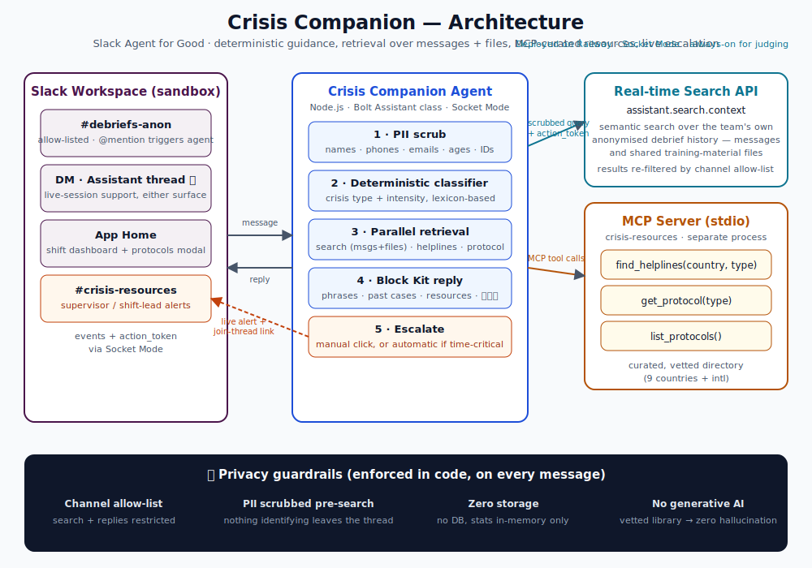

# 🕊️ Crisis Companion

**An ambient co-pilot for crisis-helpline volunteers, living where they already coordinate: Slack.**

Built for the Slack Agent Builder Challenge · Track: **Slack Agent for Good**

When a volunteer debriefs a hard session or asks for help mid-shift, Crisis Companion replies in seconds with:

- **💬 Vetted de-escalation phrasing** from a clinically-grounded library — deterministic, zero generative AI in the response path, zero hallucination by construction
- **📚 Similar past cases** from the team's own anonymised debrief history, via Slack's **Real-time Search API** (`assistant.search.context`), with permalinks to what actually worked
- **☎️ Curated referral resources and protocols** via a **Model Context Protocol (MCP) server** — country-aware helplines across 9 countries plus international fallbacks

## Privacy is architectural

- **PII scrub before search** — names, phones, emails, ages, IDs are redacted before any query leaves the thread; the reply footer reports every redaction
- **Channel allow-list** — enforced on input (where the agent responds) *and* output (which search results survive)
- **Zero storage** — no database; shift stats are in-memory and vanish on restart
- **Vetted content only** — phrases and resources come from reviewable JSON, not a model

## Architecture



Flow: volunteer message → PII scrub → deterministic lexicon classifier (type + intensity) → parallel: Real-time Search (allow-listed history) + MCP `find_helplines` + MCP `get_protocol` → single calm Block Kit reply.

## Run it

```bash
npm install
cp .env.example .env       # fill in tokens per SETUP.md
npm run seed               # seed synthetic anonymised debriefs into #debriefs-anon
npm start                  # Socket Mode agent (spawns the MCP server on first use)
```

See [SETUP.md](SETUP.md) for app creation (manifest.json included) and [docs/DEVPOST_SUBMISSION.md](docs/DEVPOST_SUBMISSION.md) for judge testing instructions.

## Stack

Node.js · Bolt for JavaScript (`Assistant` class, Socket Mode) · `assistant.search.context` · `@modelcontextprotocol/sdk` (stdio) · Block Kit

## Repo map

```
app/               Bolt agent (pipeline: scrub → classify → retrieve → reply)
mcp-server/        crisis-resources MCP server + curated dataset
scripts/seed.js    synthetic debrief corpus for the search demo
docs/              architecture diagram, demo script, Devpost pack
```

---

*Crisis Companion supports a volunteer's judgment — it never replaces it. All seeded debriefs are synthetic. Helpline numbers are from public directories; verify locally before use.*
